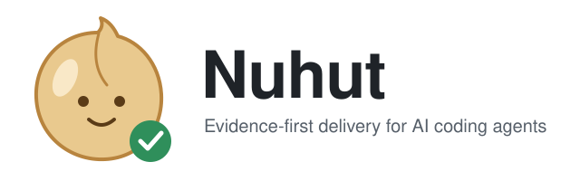
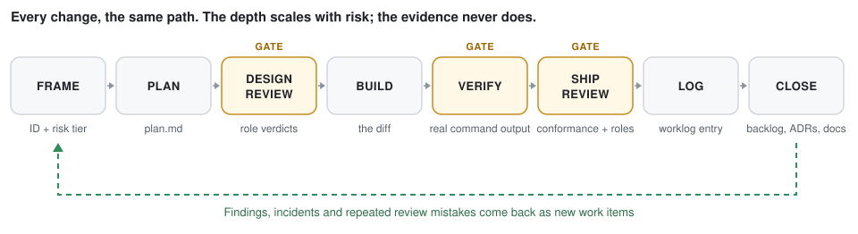

<p align="center">
  
</p>

**Nuhut** (chickpea) is a portable, stack-agnostic kit that makes an AI coding agent work
like a disciplined product team instead of a fast typist. It is small and plain, and it
holds its shape under pressure.

```sh
./install.sh /path/to/your-project        # guided setup; Enter takes every default
```

<p align="center">
  
</p>

Drop it into any project. From then on, an agent that reads `AGENTS.md` will:

1. **Frame** the request as a tracked unit of work with an ID.
2. **Plan** before editing, at a depth proportional to risk.
3. **Review** the plan (and later the result) from named professional perspectives —
   product, architecture, UX, brand, copy, SEO, CRO, security, DevOps/SRE, QA,
   accessibility, privacy/legal, and where the project has those surfaces, data
   engineering, ML/AI, and performance — recording findings and verdicts.
4. **Build** to a stated Definition of Done.
5. **Verify** with real commands and real output, never assertion.
6. **Log** what shipped, what was verified, and what is still open.
7. **Close** the loop — backlog status, ADRs, updated docs, flagged assumptions.

Every work item also resolves an **effort mode** independently of its risk tier: Lean
takes the shortest sufficient path, Normal is the balanced default, and Beast maximises
investigation and verification without widening product scope. No mode weakens security,
tests, evidence, approvals, or another requirement imposed by the risk tier.

> **Status.** The process, installer, runtime checks and hooks are tested (`validate.py`,
> `tests/smoke.py`, CI). Whether the kit measurably changes agent behaviour is what
> `benchmarks/kit-value/` exists to show. It has not been run at N≥4 yet, so no such claim
> is made here.

The commands and paths still carry the kit's working name, `ai-sdlc`: `/sdlc-*`,
`.ai-sdlc/`, and the plugin ID. Renaming them would break `--upgrade` for existing
installs, so they change only in a major release that migrates them.

## What it deliberately does NOT do

- **No tech stack.** No framework, language, package manager, cloud, CI system, or test
  runner is named anywhere in the process docs. Each project declares its own in
  `docs/project/charter.md`, and everything else refers to it indirectly ("the project's
  typecheck command"). Where it deploys is the one place a platform's name is useful —
  Vercel and a hand-run VPS fail in different ways — so those checks live in opt-in
  [deployment checklists](#deployment-platforms), installed only for the platforms a
  project names.
- **No architecture.** Monolith, monorepo, serverless, microservices, a single script —
  all fine. The architect role reviews *whatever the project chose* against its own
  stated constraints.
- **No domain assumptions.** Works for a marketing site, an internal CLI, a data
  pipeline, a RAG service, a microservice fleet, a Terraform repository, a crawler, a
  mobile app, a library, or a docs-only repo. Roles that do not apply are switched off in
  the charter, not awkwardly forced.
- **No ceremony tax.** A one-line copy fix does not trigger sixteen role reviews. Risk
  tiers (defined in `AGENTS.md`) scale both the process and the *reading* to the change —
  a Tier 3 fix has a reading list of one charter section.

## What it covers

Setup asks what the project is, and the answers decide which of the sixteen roles review
your work and which of the twenty-one skills get installed. Nothing below is on by
default. The portable `docs/` tree is copied whole either way — that is what makes
`--upgrade` work — but an inactive role's playbook is not on any reading list, so a
marketing site's agent reads what it read in 2.5.0.

| If the project… | It gets |
| --- | --- |
| has an interface | UX, brand, copy, accessibility review; design-system and a11y skills |
| is publicly discoverable | SEO and content review; content/SEO skill |
| deploys anywhere | DevOps/SRE review; release runbook, release and postmortem skills |
| holds personal data | privacy/legal review; privacy and threat-model skills |
| **owns datasets or pipelines** | data-engineer review; data contracts, pipeline runbook, data-quality gate, contract and migration skills |
| **has models, prompts, or retrieval** | ml-engineer review; eval plan, model/dataset card, evaluation gate, the `Measured` doctrine, prompt-injection and agent-permission checks |
| **runs several services or messaging** | asynchronous and distributed architecture review; service catalogue with SLOs, cross-boundary contract skill |
| **carries a latency, throughput, or cost budget** | performance-engineer review; performance budgets with recorded baselines |
| **provisions infrastructure** | an infrastructure plan/policy stage that a human reviews before it is applied |
| **acquires third-party data** | terms, robots, rate-limit, and provenance obligations checked before the fetcher is written |
| has a data layer of any kind | the migration skill: expand/migrate/contract, lock analysis, tested reverse paths |

Two things run through all of it. **Nothing probabilistic may be claimed to have
improved without a baseline** measured before the change on a golden set that is not also
changing — the kit gives that its own word, *Measured*, with the five things it must
carry. And **a prompt is executable**: it is tiered by the surface it governs, not by
being a string.

## How this relates to Spec Kit, Kiro, and the AI app builders

**Spec-driven development tools are complementary, not alternatives.** GitHub Spec Kit,
AWS Kiro and Tessl answer *what should this feature do, precisely, before an agent builds
it*. This kit answers *how does every change get made, reviewed, verified and recorded* —
risk tiers, sixteen role playbooks, the evidence vocabulary, the severity ladder,
traceability. Neither has the other's content. Use Spec Kit to specify the feature and
this to govern the change; the process documents here never dictate how a requirement is
written. When you have a spec file, pass it directly to `/sdlc-plan <path-to-spec>` — the
command ingests its acceptance criteria and scope without re-asking questions.

**AI app builders are a place to install this, not a thing to replace.** An app builder
produces code faster than anyone reviews it, and the review, verification and record of
why each change was made are exactly what it leaves out. That is what this kit is. So the
installer detects a managed platform, the charter declares the sync model and the files
the platform owns, and `05-change-control.md` yields to that table where they conflict —
see [Installing into a managed platform](#installing-into-a-managed-platform-lovable-replit-bolt-)
below. The answer to "AI builders have no discipline" is to be the discipline they
install.

**A web UI for the kit is deliberately not here.** The kit installs a read-only status
page (`docs/dashboard.html`) and nothing else, because a driving-agents-from-a-browser
product already exists first-party — Claude Code Remote Control syncs a local session to
`claude.ai/code` and mobile — and the independent attempts at that category have not found
a business model. `docs/dashboard.html` is the part that was actually missing: a glanceable
view for the human while the agents work.

## Install as a Claude Code plugin

```
/plugin marketplace add rezar-84/ai-sdlc-template
/plugin install ai-sdlc@ai-sdlc
```

That gives you the five `/sdlc-*` commands everywhere. **It ships no skills on purpose** —
skills are model-invoked, so each one costs context in every turn whether it fires or not,
and choosing them per project is the entire point of the fact model. Run the installer for
those. See `.claude-plugin/README.md`.

## Install into a project

```sh
./install.sh /path/to/your-project
```

Run in a terminal, that opens a guided setup — ten short sections, every question with a
default, **Enter** to take it:

| Key | Does |
| --- | --- |
| `Enter` | accept the value in brackets |
| `-` | leave the field blank |
| `s` | take the defaults for the rest of this section |
| `S` | take the defaults for the rest of the setup |
| `b` | go back to the previous question |
| `?` | why this question is being asked |
| `q` | quit without writing anything |

The first question is where to install. It has no default and is never guessed: the
installer refuses its own directory (and anything inside it), so running `./install.sh`
from the kit cannot scatter a project's `AGENTS.md`, `docs/` and `.claude/` over the
template. A destination that does not exist yet can be created on the spot — or pass
`--create` for the same thing without questions.

It asks who and what the project is, then what you are building — **choose every type that
applies**, `1,3` for an app that is also an API — defaulted from what is actually in the
repository. That selection derives eleven yes/no facts — interface, visual interface,
public discoverability, deployment, personal data, conversion goal, datasets or pipelines,
models or retrieval, several services or messaging, provisioned infrastructure, acquired
data — which decide which of the sixteen roles review your work and which skills get
installed. It then shows the stack,
the check commands, and the architecture it read out of the repository for you to confirm,
asks about languages if the project has an interface or public content, and takes approvers
and risk defaults.

Nothing is written until the **review screen**: every answer listed and numbered, `Enter`
to write, a number to change that one answer, `q` to quit.

What it writes into the installed files:

- `docs/project/charter.md` — identity, stack, commands, default branch, approvers,
  staleness, managed platform, accessibility target, languages and localisation, and the
  **active roles table**, ticked and unticked with the reason each row came from.
- `docs/project/architecture.md` — instantiated, not left blank: the component inventory
  (monorepo packages, compose services) and the external dependencies it found in your
  dependency list, each row marked `_(detected at install)_` for you to confirm, plus the
  three things you told it that no file could say.
- `AGENTS.md` — the "Human approval required for" and "Forbidden in this project" lines of
  the Project overrides section.
- `.ai-sdlc/profile.json` — schema 2: the facts, active roles, chosen skills, command
  table, default effort mode, and acquisition profile in machine-readable form, so
  `/sdlc-verify` and the skills can act on them without parsing
  prose. Derived, never authored: the charter is the source of truth and wins on conflict.

Anything it could not establish is left blank on purpose. A blank cell is read as *Unknown*
by the process; a wrong one produces confidently false "verified" claims, so nothing is
guessed — not one check command, not one data category.

For scripts, CI, or a plain copy with no questions:

```sh
./install.sh /path/to/your-project ACME -y          # ACME = the work-item ID prefix
```

`-y` (also implied when stdin is not a terminal) takes every default, tailors nothing, and
installs only the skills that do not depend on an answer. The target directory is required
in this mode — without a terminal there is nobody to ask. Other flags: `--docs-dir <name>`
to install the docs under a different directory, `--harness <list>`, `--profile
<full|compact>`, `--effort-mode <lean|normal|beast>`, `--acquisition-profile
<standard|advanced>`, `--hooks`, `--create`, `--no-skills`, `--dry-run`, `--lang <code>`,
`--scaffold-tests`, `--scaffold-ci <github|gitlab>`, `--deploy <list>`, and `--upgrade`.

### Deployment platforms

The process documents never name a platform. What differs between platforms — Vercel
previews using production variables, a Dokploy bind mount wiped on redeploy, Cloudflare's
*Flexible* TLS looping forever, a Kamal accessory that `deploy` never upgrades — lives in
one checklist per platform, copied into `docs/platforms/` only when the project uses it:

`cloudflare-workers` · `cloudflare-edge` · `vercel` · `netlify` · `fly` · `railway` ·
`render` · `heroku` (and Dokku) · `dokploy` · `coolify` · `kamal` · `vps` · `kubernetes` ·
`aws` · `gcp` (and Firebase) · `azure` · `digitalocean`

The wizard detects what it can from the repository (`wrangler.toml`, `vercel.json`,
`fly.toml`, a Compose file on `dokploy-network`, Coolify's `SERVICE_FQDN_` variables,
`config/deploy.yml`, `Chart.yaml`, …), pre-selects it, and asks. Your answer decides and is
written into the charter's **Deployment platforms** row, which the `devops-sre` review and
the release runbook read. Anything unlisted is a valid answer (`other`): it is recorded,
and the neutral playbook carries the review alone.

```sh
./install.sh /path/to/project ACME -y --deploy coolify,cloudflare-edge
```

With `-y` and no `--deploy`, nothing is installed from detection alone — the installer says
what it found and which flag confirms it. Re-running with `--deploy <id>` later adds a
checklist without touching anything else; `--upgrade` refreshes the ones installed.

`Advanced` acquisition enables browser automation, OCR,
resilient extractors, and authorised session flows. It is a capability profile, not
permission: authentication, paywalls, CAPTCHA, explicit denial, or other access controls
still require target-owner authorisation or an approved API/export route.

The installer is `install.py` (Python 3.6+, standard library only); `install.sh` is a
wrapper that runs it. Nothing the kit *installs* needs Python — only the installer does.
The optional `--hooks` scripts need `jq`, and say so and allow the call when it is absent.

## Which agent tools this works with

`AGENTS.md` is the contract, and most tools now read it directly. The rest each look in
their own file, so the installer points them at it — appending to a file that already
exists, never overwriting, and never copying the contract itself.

| Tool | Wiring |
| --- | --- |
| Codex, Jules, Zed, Factory, opencode | Nothing to do — they read `AGENTS.md` |
| Claude Code | `CLAUDE.md`, plus slash commands, skills and optional hooks |
| Gemini CLI · Amp · Copilot · Cursor · Windsurf · Cline · Aider | `--harness gemini,amp,copilot,cursor,windsurf,cline,aider` (or `all`) |

```sh
./install.sh /path/to/project ACME -y --harness claude,cursor,copilot
```

**If nothing points at `AGENTS.md`, the kit is installed and inert** — and nothing about
the repository looks wrong. The installer warns when it wires nothing, and
`/sdlc-doctor` rates that the most severe finding it can report.

Only Claude Code has model-invoked skills, so on every other tool the routing lives in
the last table of `docs/CARD.md`: *when X is true, read Y*.

## Reading cost, and small models

Measured, and enforced by `validate.py` — the figures in `AGENTS.md` fail CI if they
drift from the files:

| Change | Full | Compact |
| --- | --- | --- |
| Tier 3 | <3k | <3k |
| Tier 2, two roles | ~23k | ~17k |
| Tier 1, four roles | ~26k | ~20k |

`--profile compact` installs the card, roles, templates and project records but omits the
numbered `process/` documents the card summarises. One source for every rule either way —
it is a packaging choice, not a second copy written in shorter words. A Tier 1 change
then has no escalation document to appeal to, so choose it deliberately; the charter's
**Agent environment** table records which profile is installed and the minimum context
window the reading list assumes.

`--docs-dir` is for a project whose `docs/` already means something else. The installed
contract, commands, and skills all follow the chosen name automatically.

## Stack adapters and scaffolding

The portable process accepts any stack. The installer additionally recognises common
project markers for Node/TypeScript, Python, Go, Rust, PHP, Ruby, Java/Kotlin with Maven
or Gradle, and C#/.NET. Adapters detect existing frameworks, test tooling, ORMs, database
drivers, migration tools, and quality commands; they do not install or replace them.

Detected data layers include Prisma, Drizzle, TypeORM, SQLAlchemy/Alembic, Django ORM,
GORM/sqlc, Diesel/SQLx/SeaORM, Eloquent, Doctrine, Active Record, JPA/Hibernate,
Flyway/Liquibase, Entity Framework Core, and Dapper. Engine markers cover PostgreSQL,
MySQL/MariaDB, SQLite, MongoDB, Redis, SQL Server, and Oracle.

Two explicit flags turn detection into project-owned starting files:

```sh
./install.sh /path/to/project ACME -y --scaffold-tests
./install.sh /path/to/project ACME -y --scaffold-ci github
./install.sh /path/to/project ACME -y --scaffold-ci gitlab
```

`--scaffold-tests` creates `docs/project/test-plan.md` and
`.ai-sdlc/testing-profile.json`, both marked as detected and requiring confirmation.
`--scaffold-ci` creates `.github/workflows/quality.yml` or `.gitlab-ci.yml` from the
project's detected/confirmed commands. It refuses an empty command set. Scaffolding never
overwrites an existing file, never installs a dependency, and leaves runtime and service
version confirmation to the project charter. Generated jobs are manual-only until a
human confirms the commands and deliberately enables push or pull-request triggers.

The installer copies `AGENTS.md` to the project root, `docs/` into the project, the four
slash commands into `.claude/commands/`, and the selected skills into `.claude/skills/`;
substitutes `{{PROJECT_NAME}}`, `{{PREFIX}}`, and `{{DOCS_DIR}}` in all of them; adds a
`CLAUDE.md` pointer if none exists; and records checksums for portable files in
`.ai-sdlc/manifest.json`. A normal re-run **never overwrites an existing file** — it is
safe, reuses the docs directory it finds, and only fills in what is missing.

Manual install is a copy plus a find-and-replace — the substitution is not optional, and
skipping it leaves `{{PREFIX}}-###` as a literal path in the docs the agent follows:

```sh
cp    template/AGENTS.md          /path/to/your-project/AGENTS.md
cp -r template/docs               /path/to/your-project/docs
cp -r optional/claude-commands    /path/to/your-project/.claude/commands
cp -r optional/skills             /path/to/your-project/.claude/skills   # or just the ones you want
cd /path/to/your-project
grep -rl '{{' docs AGENTS.md .claude | xargs sed -i 's/{{PREFIX}}/ACME/g; s/{{PROJECT_NAME}}/your-project/g; s/{{DOCS_DIR}}/docs/g'
```

Then, in the target project:

1. Read `docs/project/charter.md` and correct or complete it. Guided setup fills in what it
   can establish; constraints, environments, and sources of truth are yours. An agent that
   guesses a check command because the charter was blank will produce confidently false
   "verified" claims.
2. Confirm nothing was missed: `grep -rn '{{' docs AGENTS.md .claude` should be empty.
3. Fill in the rest of the "Project overrides" section of `AGENTS.md`.

That is all. The installed kit is plain Markdown: no build step, no dependency, and
nothing to run.

## Skills

`optional/skills/` is a catalogue of twenty-one skills that make the process fire on its own.
The slash commands wait to be typed; skills are model-invoked — the agent loads one when the
situation its description names actually appears.

| Skill | Fires when | Installed when |
| --- | --- | --- |
| `sdlc-intake` | a request arrives with no work item | always |
| `sdlc-evidence-check` | about to claim "done", "passing", "verified" | always |
| `sdlc-charter-audit` | before relying on the charter, or when it looks stale | always |
| `sdlc-adr` | a decision would be expensive to reverse | always |
| `sdlc-accessibility-audit` | UI is added or changed | there is an interface |
| `sdlc-design-review` | screens, components, or tokens change | there is a visual interface |
| `sdlc-content-seo` | public pages, copy, routes, or metadata change | content is public |
| `sdlc-privacy-review` | forms, analytics, tracking, logs, or claims change | personal data is held |
| `sdlc-threat-model` | auth, uploads, payments, or an external interface appears | data is held, or it deploys |
| `sdlc-release` | shipping to a real environment | it deploys |
| `sdlc-postmortem` | something broke, or a release was reverted | it deploys |
| `sdlc-i18n-audit` | strings, screens, or locales change | it ships in 2+ languages |
| `sdlc-translation-review` | content appears in a non-source language | it ships in 2+ languages |
| `sdlc-managed-platform` | editing platform config, history, or deploys | a platform co-owns the repo |
| `sdlc-doctor` | the project's own documents may not describe reality | always |
| `sdlc-migration` | a schema migration or backfill appears | a data layer was detected |
| `sdlc-data-contract` | a schema, pipeline output, or event payload changes | there are datasets, or data is acquired |
| `sdlc-eval-gate` | a prompt, model, retrieval config, or quality claim changes | models or retrieval are on the product path |
| `sdlc-service-contract` | an API or event contract crosses a service boundary | several services, or messaging |
| `sdlc-perf-budget` | a hot path, query, payload, or cache changes | there is a backend, data, or model workload |
| `sdlc-scrape-compliance` | a fetcher, crawler, or third-party source is added | the project acquires third-party data |

Setup evaluates that list against your answers and installs only what applies — an
unused skill is a description competing for attention in every future context window. Add
one later by copying its directory into `.claude/skills/` and replacing the placeholders.
See `optional/skills/README.md` for how to write your own.

## Scripts for what does not need judgment

A rule written as prose is a request the agent may or may not honour. The same rule as a
check either passes or fails. So the parts of the process a machine can decide are a
script, not a paragraph. Every install gets
`.ai-sdlc/bin/sdlc.py`: standard-library Python, kit-managed, and refreshed by `--upgrade`.

```sh
python3 .ai-sdlc/bin/sdlc.py doctor            # blank commands, stale records, IDs that
                                               # do not join, profile drift, no contract pointer
python3 .ai-sdlc/bin/sdlc.py doctor --strict   # exit 1 on a fail-level finding, for CI
python3 .ai-sdlc/bin/sdlc.py verify            # run the charter's checks in order and record
                                               # the output under .ai-sdlc/evidence/
python3 .ai-sdlc/bin/sdlc.py plan-check ACME-12 # files the branch changed that the Tier 1
                                               # plan does not name, and planned paths untouched
python3 .ai-sdlc/bin/sdlc.py view              # draw the records as an interactive page
python3 .ai-sdlc/bin/sdlc.py metrics           # process measures, leading and lagging
```

`verify` exists so a "Verified" claim can cite a file the script wrote instead of the
agent's memory of a run. `/sdlc-doctor` and `/sdlc-verify` call the script first and keep
the judgment for themselves: severity, behavioural checks, and what to fix first. It works
with any agent tool that can run `python3`. `/sdlc-review` opens every Tier 1 ship review
with `plan-check`, so a diff that drifted from its approved plan is visible before any role
reads it.

### Seeing the work

Records written for an agent are hard for a person to read once a project is real: a
worklog runs to thousands of lines, and one item's story is spread over a backlog row, a
plan, two reviews and a worklog entry. `sdlc.py view` reads them all at the moment you run
it and opens one page, joined by work item ID:

- **Map:** the whole project as a mind map (status, owner role, documents), folding and
  unfolding, with each label a link.
- **Board:** Now, Next, Blocked, Parked, Later and Done, filtered by owner or tier. Cards
  show what each item still waits on.
- **Activity:** what is in flight, and the latest worklog entries with what they left
  undone.
- **Waiting on you:** Parked and Blocked items, who they wait on, and for how long.
- **Item:** the backlog row, plan, reviews, worklog entries, commits and every record
  that mentions it, with a lifecycle stepper that shows which step has no record yet.
- **Documents:** any record with a clickable outline, where IDs and relative links
  become links.

It writes nothing into the records and adds no format for the agent to keep. The page
goes to `.ai-sdlc/view/index.html`, which git ignores, and works offline. Rows the view
cannot read are listed on the page rather than dropped. `sdlc.py metrics` prints the
process measures the page also shows (work in progress, time waiting on a human, verify
pass rate, throughput, lead time, lifecycle gaps), each labelled leading or lagging, with
the record it came from.

The opt-in `--hooks` go one step further for Claude Code. They deny the tool call itself:

- a commit with no work item ID, or with a credential in it
- an edit to a single-writer path
- an edit to a reproducing test locked while its defect is fixed
- a command, such as a production deploy, that `.ai-sdlc/gates.txt` says a human must pass

A skill makes a violation rare, and a hook makes it close to impossible. See
`optional/hooks/README.md` for what each hook can and cannot see.

## Installing into a managed platform (Lovable, Replit, Bolt, …)

A project that lives on an AI app builder or cloud IDE is co-owned by another agent: the
platform edits files, syncs the repository, and often deploys the default branch on its
own. The kit is designed not to break that:

- **The installer detects** common platform markers (`.replit` / `replit.nix` /
  `replit.md`, a Lovable project, `.bolt/`, `.idx/`, `glitch.json`, CodeSandbox config)
  and prints platform-specific next steps. Detection is read-only, and the installer
  still never overwrites or edits an existing file — platform config is left exactly as
  found.
- **The charter declares the platform** in its "Managed platform" table: the sync model,
  the files the platform owns (never hand-edited), where the platform's own agent reads
  its instructions, and how deploys happen.
- **Process rules yield to that table.** "Managed platforms" in
  `docs/process/05-change-control.md` sets the standing rules: no hand-edits to
  platform-owned files, no history rewrites on any branch the platform syncs, treat an
  auto-deployed merge as a release, and point the platform's instruction file
  (`replit.md`, Lovable project knowledge) at `AGENTS.md` so the platform's agent and
  this process cannot drift apart.

Platform names appear only in this README and in the charter you fill in — the process
docs stay platform-agnostic the same way they stay stack-agnostic.

## Layout

```
template/
  AGENTS.md                  the operating contract — the file the agent always reads
  docs/
    README.md                map of the kit + cold-start reading order for an agent
    process/                 HOW we work. Portable. Same in every project. Rarely edited.
      00-operating-model.md      the loop, the modes, and what to do when a human is needed
      01-lifecycle-gates.md      appendix: G0..G6, for standing up a new project only
      02-role-reviews.md         who reviews what, at which stage, and what a verdict means
      03-ready-and-done.md       Definition of Ready / Definition of Done
      04-quality-gates.md        test strategy, CI gate order, bug severity ladder
      05-change-control.md       branches, commits, PRs, approvals, ADRs, rollback
      06-evidence-and-claims.md  the no-fabrication doctrine; provenance; assumptions
      07-traceability.md         IDs, the backlog row spec, what gets logged where
      08-content-and-translation.md  source language, machine translation, RTL, per-locale checks
      09-probabilistic-and-data-systems.md  models, prompts, evaluation, pipelines, acquired data
      10-multi-agent.md          claiming, single-writer files, review fan-out, handoff
    roles/                   WHO reviews. One playbook per professional perspective.
      README.md + 16 role playbooks
    templates/               Blank artifacts to copy when a project needs one.
    CARD.md                  the operating card: the whole standard on one page
    dashboard.html           read-only status page (state in dashboard-state.js)
    project/                 WHERE this project's filled-in reality lives.
      charter.md  backlog.md  worklog.md  assumptions-and-risks.md
      adr/  reviews/  plans/  postmortems/  worklog-archive/
.claude-plugin/              plugin + marketplace manifests (commands only, no skills)
optional/
  hooks/                     opt-in Claude Code enforcement (--hooks)
  claude-commands/           Claude Code slash commands that drive the loop
  skills/                    model-invoked skills, installed per project need
  platforms/                 deployment checklists, installed per platform used (--deploy)
  locales/                   translations of the installer's own prompts
  runtime/                   sdlc.py (doctor, verify, plan-check, metrics) and the view,
                             installed to .ai-sdlc/bin/ (always)
  harness/claude/            examples to adapt, never installed: settings, verifier subagent
install.py                   the installer; install.sh is a wrapper around it
validate.py                  source and installed-output validation
tests/smoke.py               installer boundary and workflow tests
benchmarks/effort-modes/     optional isolated-run protocol and measurement scorer
benchmarks/kit-value/        does the kit change agent behaviour? no kit vs kit vs kit + hooks
.github/workflows/           continuous validation and tag-based releases
VERSION                      the kit version, stamped into installed AGENTS.md
LICENSE · SECURITY.md · CONTRIBUTING.md · CHANGELOG.md
                             distribution and project governance
```

## The three kinds of file

Keeping these separate is the main structural idea of the kit.

| Kind | Lives in | Edited | Purpose |
| --- | --- | --- | --- |
| **Standard** | `docs/process/`, `docs/roles/` | Almost never, and only deliberately | Defines how work is done. Identical across projects, so an agent's behaviour is predictable everywhere. |
| **Template** | `docs/templates/` | Never (copied, not edited) | Blank forms. Copy into `docs/project/` when the project needs that artifact. |
| **Project record** | `docs/project/` | Constantly | This project's truth: charter, backlog, worklog, decisions, reviews, risks. |

A common failure in hand-rolled agent docs is mixing these — process rules get buried
inside a project brief, so they cannot be reused, and project facts get written into
process docs, so they go stale silently. Do not merge the directories.

## Upgrading the kit later

```sh
./install.sh /path/to/your-project ACME --upgrade
```

A project installed before 3.3 needs one extra run, once:

```sh
./install.sh /path/to/your-project ACME --upgrade --adopt
```

`--adopt` takes over the two things older versions left for you to merge by hand —
sections 1–8 of `AGENTS.md` and the `/sdlc-*` commands — after backing up the current
copies. A plain `--upgrade` never does this on its own, and says when it is needed.

`--upgrade` manages `docs/README.md`, `docs/process/`, `docs/roles/`, `docs/templates/`,
`docs/platforms/`, the `/sdlc-*` commands, and any kit skill the project already has. It verifies their recorded checksums first and
stops if a managed file was locally modified or removed. It backs up affected files under
`.ai-sdlc/backups/`, writes updates
atomically, removes obsolete files previously owned by the manifest, and restores the old
state if an update fails. Legacy installations receive a full portable-file backup on
their first manifest-based upgrade.

`AGENTS.md` is split in two by marker comments. Sections 1–8 are the kit's: an upgrade
replaces them, and stops — like any other managed file — if they were edited. Section 9,
"Project overrides", is yours and is never touched. The charter and the rest of
`docs/project/` are yours too, with one additive exception: when a new kit version adds a
charter row, the upgrade inserts it blank, in its own table, and lists it. An existing row
is never changed. Skills the project did not choose are not added by an upgrade — `ls
optional/skills` shows what a newer version ships.

This only works if you keep project-specific rules where they belong: in `AGENTS.md`
("Project overrides") and in `docs/project/`, never inside `process/` or `roles/`. The
installed `AGENTS.md` carries the kit version it came from, in an HTML comment near the
top. The manifest records the version of the managed process, role, and skill files;
`VERSION` here is the current one.

## Validating and contributing

The kit validates itself with standard-library-only commands:

```sh
python3 validate.py
python3 tests/smoke.py
python3 -m py_compile install.py validate.py tests/smoke.py optional/runtime/sdlc.py
python3 optional/runtime/sdlc.py --selftest
python3 benchmarks/effort-modes/score.py --selftest
python3 benchmarks/kit-value/score.py --selftest
```

Whether the kit is worth its context cost is an open question, not a claim this README
makes. [`benchmarks/kit-value/`](benchmarks/kit-value/README.md) is the protocol for
answering it: the same tasks with no kit, with the kit, and with the kit plus hooks, scored
on correctness, safety, fabricated verification claims, traceability, and ceremony.

`validate.py` also cross-checks the pairings the kit maintains by hand — every role has a
playbook, a charter row, and a README entry; every template is in the docs map; every
skill has an install rule; every check stage has a charter row — and fails if the
docs-tree size quoted in `AGENTS.md` has drifted from the measured one.

CI runs these checks on every push and pull request. Tags shaped like `v3.2.0` are checked
against `VERSION` before release creation. See `CONTRIBUTING.md`, `SECURITY.md`,
`CHANGELOG.md`, and `LICENSE` for project governance and distribution terms.

## Conventions used in the docs

- `{{PLACEHOLDER}}` — a value to find-and-replace at install time.
- `_(fill in)_` — prose you write per project; delete the marker when filled.
- `<angle brackets>` — an example value in a command or path.
- Every artifact in `docs/project/` carries a frontmatter block with `status`, `owner`,
  and `last-reviewed`. An agent must treat a missing or old `last-reviewed` as a signal
  that the document may not describe reality — verify before relying on it.
